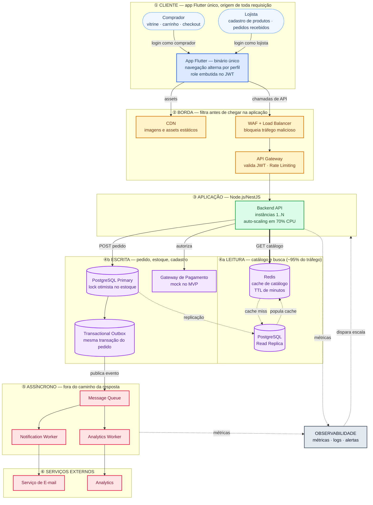

# Plano de Desenvolvimento: Achou! — Marketplace de E-commerce

## Arquitetura

**Decisões-chave do desenho**

* **Cache primeiro:** leituras de catálogo são atendidas pelo Redis; apenas o *cache miss* alcança a réplica de leitura, isolando o banco durante picos de 20x.
* **Separação leitura/escrita:** escritas (pedido, estoque, cadastro) vão para o *primary*; consultas vão para a *read replica*.
* **Outbox transacional:** eventos são gravados na mesma transação do pedido e só então publicados na fila, evitando perda de notificação em caso de falha.
* **Escala horizontal por instância:** como o Node.js é single-thread por processo, a capacidade cresce adicionando réplicas do contêiner, guiadas pelas métricas de observabilidade (gatilho em 70% de CPU).

## Documentação

| Documento | Conteúdo |
|---|---|
| [docs/data-model.md](docs/data-model.md) | Modelagem do banco: diagrama ER, tabelas, índices e decisões |
| [docs/api-design.md](docs/api-design.md) | Contrato da API: rotas, erros, cache e busca |
| [docs/setup.md](docs/setup.md) | Subir o ambiente local e rodar migrations |
| [docs/observabilidade.md](docs/observabilidade.md) | Métricas Prometheus, dashboard Grafana e alertas |
| [docs/achou-marketplace.postman_collection.json](docs/achou-marketplace.postman_collection.json) | Collection do Postman com as rotas e testes |

## 1. Disciplinas Aplicadas (Ordenadas por Nível de Importância)

Abaixo estão as disciplinas do curso mapeadas para a execução deste projeto. As marcadas com `[x]` representam o caminho crítico indispensável para garantir a alta disponibilidade sazonal e a entrega do MVP em tempo recorde.

**Alta Criticidade (Core do Desafio DevOps e Escalabilidade)**

* [x] **Arquitetura de Microsserviços e Escalabilidade:** Desenho estrutural para absorver picos de 20x no tráfego isolando o catálogo.
* [x] **Desenvolvimento de Software Integrado – DevOps:** Cultura e ferramentas para unir a codificação em Node.js/Flutter com a operação de infraestrutura.
* [x] **Computação em Nuvem:** Base para o provisionamento de recursos elásticos.
* [x] **Monitoramento e Análise de Logs:** Observabilidade vital para acionar o auto-scaling dinamicamente quando a CPU atingir 70%.
* [x] **Orquestração de Contêineres e Gerenciamento de Cluster:** Gestão das réplicas da API Node.js, escalando horizontalmente para absorver a concorrência dos picos.
* [x] **Integração e Entrega Contínua (CI/CD):** Automação de builds e testes para viabilizar entregas seguras no curtíssimo prazo de 4 aulas.
* [x] **Testes Automatizados e Contínuos:** Foco primário em testes de carga/estresse para validar o hit rate do cache no Redis.

**Média Criticidade (Produto, Segurança e Fluxo Ágil)**

* [x] **Infraestrutura Automatizada:** Uso de IaC para subir rapidamente o banco PostgreSQL e o Redis.
* [x] **Design da Experiência do Usuário:** Arquitetura de informação e fluxos de navegação otimizados no Flutter para garantir conversão rápida durante campanhas de Black Friday.
* [x] **Desenvolvimento de Software Seguro – DevSecOps:** Implementação de JWT e Rate Limiting no API Gateway contra DDoS.
* [x] **Metodologias Ágeis em Gestão de Projetos:** Divisão estrita do escopo para caber nas restrições de tempo (2h por aula).
* [x] **Controle de Versão e Gerenciamento de Configuração:** versionamento de código e infraestrutura.
* [x] **Gerenciamento de Produtos:** Definição clara do que entra no MVP (caminho feliz) e do que fica no backlog.

**Baixa Criticidade (Contexto de Negócio e Apoio)**

* [ ] **Computação sem Servidores:** Embora relevante para escalabilidade, o foco principal será em clusters conteinerizados.
* [ ] **Fundamentos de Engenharia de Software:** Base teórica já abstraída na execução prática.
* [ ] **Direito Digital e LGPD:** Vital para produção, mas secundário para a prova de conceito técnica (MVP).
* [ ] **Documentação Técnica:** Focada estritamente no essencial (README estruturado).
* [ ] **Ecossistemas de Startups:** Contexto de negócio que justifica o produto.
* [ ] **Tópicos Avançados em Engenharia de Software:** Elementos teóricos adicionais.

---

## 2. Visão Geral

Construção de um MVP para um marketplace de nicho focado em conectar lojistas e compradores. A arquitetura foi desenhada com tolerância zero a falhas durante campanhas promocionais, utilizando Node.js com NestJS no backend, Flutter no frontend para cobrir múltiplas plataformas com código único, e Redis como camada de proteção principal para o banco de dados.

## 3. Escopo (Principais Funcionalidades)

* **Vitrine e Busca:** Catálogo de produtos servido quase integralmente via cache.
* **Carrinho e Checkout:** Adição de itens e consolidação do pedido.
* **Pagamento:** Mock de autorização financeira simulando delay de rede.
* **Painel do Vendedor:** Tela enxuta para cadastro rápido de produtos (POST) e listagem de pedidos recebidos.

## 4. Cronograma (Mapeamento das Aulas)

* **Aula 1 (Hoje):** Definição da arquitetura, criação do repositório base, mapeamento de disciplinas e setup inicial das esteiras de CI.
* **Aula 2 (Backend & Dados):** Modelagem do PostgreSQL, criação das rotas REST em NestJS e implementação da camada de cache no Redis.
* **Aula 3 (Frontend UX/UI):** Construção das interfaces em Flutter (vitrine, carrinho e painel do vendedor) e integração com as APIs desenvolvidas.
* **Aula 4 (Checkout & Carga):** Fechamento do fluxo de transação, simulação de testes de carga na rota de catálogo e validação do comportamento do cluster.

## 5. Estratégia de Testes

* **Testes de Integração:** Validação da consistência de dados entre a API Node.js e o PostgreSQL (ex: não permitir saldo negativo de estoque).
* **Testes de Carga/Estresse:** Simulação de um evento promocional disparando milhares de requisições de leitura simultâneas contra a API para comprovar a eficiência da configuração do Redis e o comportamento do auto-scaling do cluster.

## 6. Estratégia de Segurança (DevSecOps)

* **Proteção de Borda:** Rate Limiting configurado no API Gateway para barrar abusos volumétricos nas rotas não-cacheadas (ex: fechamento de pedido).
* **Autenticação:** Uso de tokens JWT para blindar as rotas do painel do vendedor.
* **Prevenção de Injeção:** Consultas parametrizadas por padrão através do ORM, eliminando concatenação de SQL.

## 7. Plano de Operação

* **Perfil de Tráfego:** Sazonalidade extrema (tráfego estável na maior parte do tempo, com saltos pontuais).
* **Taxa de Requisições Estima:** ~50 req/s (normal) a ~1.000 req/s (pico).
* **Tática de Contingência:** Pré-provisionamento de instâncias horas antes de eventos de grande porte para evitar latência no tempo de subida (cold start) dos contêineres, mantendo auto-scaling ativo como rede de segurança.

## 8. Riscos Conhecidos

* **Corrida de Concorrência (Race Condition):** Esgotamento simultâneo do mesmo item no estoque. Será mitigado com travamento (lock) otimista no banco transacional.
* **Tempo de Execução Crítico:** O prazo de 2 horas por aula exige zero desvio de escopo. O design da interface deve ser pragmático.
* **Invalidação de Cache:** Risco de o usuário visualizar um preço antigo durante a atualização de catálogo. A política de TTL (Time to Live) será configurada para minutos, minimizando o impacto.