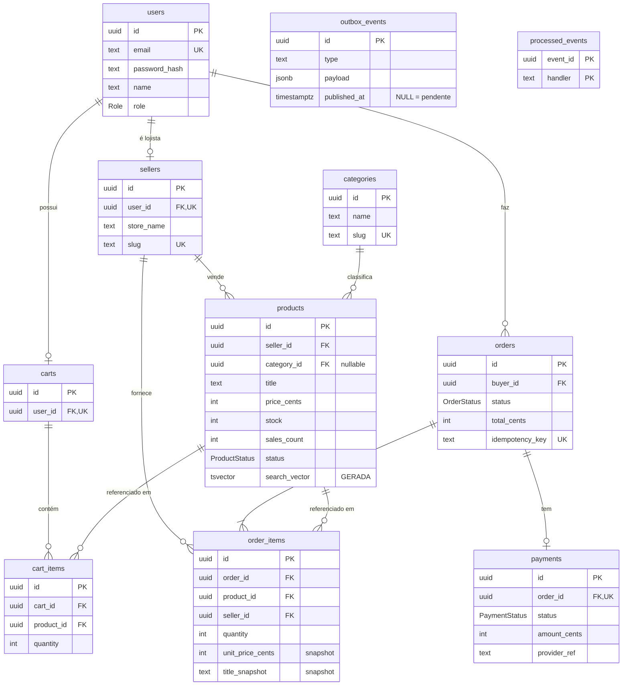

# Modelagem de Dados — Achou! Marketplace

PostgreSQL 17. Documento gerado a partir do schema real em execução, não do plano.

Fonte da verdade: as migrations em [`backend/prisma/migrations/`](../backend/prisma/migrations/).
O `schema.prisma` reflete o banco; onde os dois divergem, vale o SQL.

---

## 1. Diagrama



`outbox_events` e `processed_events` aparecem soltas de propósito: **não têm
chave estrangeira para nada**. Isso é intencional e está explicado na seção 6.

---

## 2. Domínios

| Domínio | Tabelas | Responsabilidade |
|---|---|---|
| **Identidade** | `users`, `sellers` | Contas, perfis e autenticação |
| **Catálogo** | `products`, `categories` | Oferta, estoque e busca |
| **Compra** | `carts`, `cart_items` | Intenção de compra (volátil) |
| **Venda** | `orders`, `order_items`, `payments` | Transação consolidada (imutável) |
| **Integração** | `outbox_events`, `processed_events` | Eventos assíncronos |

A fronteira entre **Compra** e **Venda** é a mais importante do modelo: carrinho
é rascunho descartável, pedido é registro contábil que nunca deve mudar
retroativamente.

---

## 3. Tabelas

### `users`

| Coluna | Tipo | Nulo | Default |
|---|---|---|---|
| `id` | `uuid` | não | — |
| `email` | `text` | não | **UNIQUE** |
| `password_hash` | `text` | não | — |
| `name` | `text` | não | — |
| `role` | `Role` | não | `COMPRADOR` |
| `created_at` / `updated_at` | `timestamptz` | não | `CURRENT_TIMESTAMP` |

Senha nunca em texto puro: `bcrypt` com custo 10, gravado em `password_hash`.

### `sellers`

Perfil de loja, 1:1 opcional com `users`. Só existe quando `role = LOJISTA`.

| Coluna | Tipo | Observação |
|---|---|---|
| `user_id` | `uuid` | **UNIQUE** — garante o 1:1 |
| `store_name` | `text` | Nome exibido na vitrine |
| `slug` | `text` | **UNIQUE** — derivado do nome, sem acento |

Separar `sellers` de `users` evita dezenas de colunas nulas em toda conta de
comprador, e dá um `seller_id` estável para as FKs do catálogo e dos pedidos.

### `products`

| Coluna | Tipo | Nulo | Default |
|---|---|---|---|
| `seller_id` | `uuid` | não | FK → `sellers` |
| `category_id` | `uuid` | **sim** | FK → `categories` |
| `title` | `text` | não | — |
| `description` | `text` | sim | — |
| `price_cents` | `integer` | não | — |
| `stock` | `integer` | não | `0` |
| `sales_count` | `integer` | não | `0` |
| `status` | `ProductStatus` | não | `ACTIVE` |
| `search_vector` | `tsvector` | sim | **GENERATED ALWAYS** |

`search_vector` é mantida pelo próprio Postgres a cada `INSERT`/`UPDATE`, sem
trigger e sem código de aplicação. A expressão está na migration
`busca_sem_acento`; detalhes de ranking em [api-design.md](api-design.md).

### `carts` e `cart_items`

| `cart_items` | Tipo | Observação |
|---|---|---|
| `cart_id` | `uuid` | FK → `carts` |
| `product_id` | `uuid` | FK → `products` |
| `quantity` | `integer` | — |

**Não existe coluna de preço.** Explicado na seção 5.

`UNIQUE (cart_id, product_id)` faz o mesmo produto nunca aparecer em duas linhas:
adicionar de novo incrementa a quantidade em vez de duplicar a linha.

### `orders` e `order_items`

| `orders` | Tipo | Observação |
|---|---|---|
| `buyer_id` | `uuid` | FK → `users` |
| `status` | `OrderStatus` | `PENDING_PAYMENT` inicial |
| `total_cents` | `integer` | Soma congelada no fechamento |
| `idempotency_key` | `text` | **UNIQUE** — impede pedido duplicado |

| `order_items` | Tipo | Observação |
|---|---|---|
| `product_id` | `uuid` | Rastreabilidade |
| `seller_id` | `uuid` | **Desnormalizado** — evita `JOIN` no painel do lojista |
| `unit_price_cents` | `integer` | **Snapshot** do preço na compra |
| `title_snapshot` | `text` | **Snapshot** do título na compra |

### `payments`

1:1 com `orders` (`order_id` é **UNIQUE**). `provider` default `'mock'` no MVP;
`provider_ref` guarda o identificador devolvido pelo gateway real quando existir.

### `outbox_events` e `processed_events`

| `outbox_events` | Tipo | Observação |
|---|---|---|
| `type` | `text` | Ex.: `pedido.criado` |
| `payload` | `jsonb` | Corpo do evento |
| `published_at` | `timestamptz` | **NULL = pendente** |

`processed_events` tem PK composta `(event_id, handler)`: o mesmo evento pode ser
consumido por vários workers, e cada um registra o seu próprio consumo.

---

## 4. Enums

| Enum | Valores |
|---|---|
| `Role` | `COMPRADOR`, `LOJISTA` |
| `ProductStatus` | `ACTIVE`, `INACTIVE`, `ARCHIVED` |
| `OrderStatus` | `PENDING_PAYMENT`, `PAID`, `PAYMENT_FAILED`, `FULFILLED`, `CANCELLED` |
| `PaymentStatus` | `PENDING`, `AUTHORIZED`, `DECLINED`, `REFUNDED` |

Enum nativo do Postgres em vez de `text` com `CHECK`: o banco recusa valor
inválido, e o Prisma gera o tipo TypeScript correspondente automaticamente.

`INACTIVE` (lojista despublicou temporariamente) e `ARCHIVED` (removido) são
distintos de propósito — o primeiro volta, o segundo não.

---

## 5. Decisões de Modelagem

### Dinheiro em centavos, sempre `integer`

`price_cents = 24990` significa R$ 249,90. Nunca `float`/`double`: base 2 não
representa 0,10 exatamente, e o erro acumula em somatórios de carrinho.
`numeric` seria correto, mas `integer` é mais rápido e suficiente — não há
fração de centavo no domínio.

### Carrinho sem preço

`cart_items` guarda apenas `product_id` e `quantity`. Preço e disponibilidade
são resolvidos na leitura e **revalidados no checkout**.

Guardar preço no carrinho significaria congelar valor por tempo indeterminado —
um carrinho abandonado há seis meses "garantiria" o preço antigo. E o carrinho
tampouco reserva estoque: reserva exigiria TTL e job de expiração, complexidade
que não se paga no MVP.

### Pedido com snapshot

`order_items` copia `unit_price_cents` e `title_snapshot` no momento da compra.

É o oposto deliberado do carrinho. Se o lojista reajustar o preço amanhã, o
pedido de hoje precisa preservar o que foi cobrado. **Nunca renderize um pedido
histórico fazendo `JOIN` com o preço atual do produto** — isso reescreveria o
passado e quebraria a conciliação financeira.

### `sales_count` desnormalizado

Contador redundante em `products`, incrementado pelo worker quando o pedido é
pago. Poderia ser derivado de `order_items` com agregação, mas essa agregação
cairia na rota mais quente da API (ranking de busca). O custo é manter o
contador em sincronia; o ganho é não fazer `JOIN` agregado a cada busca.

### `seller_id` duplicado em `order_items`

Já é alcançável via `product → seller`. Está duplicado para o painel do lojista
filtrar direto por `seller_id`, com índice próprio, sem `JOIN` com `products`.

### Soft delete no catálogo

Produto nunca é removido: `status = ARCHIVED`. `order_items.product_id` aponta
para ele com `ON DELETE RESTRICT`, então apagar quebraria o histórico de pedidos
pagos. O banco impede fisicamente.

---

## 6. Integridade Referencial

| Origem | Destino | `ON DELETE` | Efeito |
|---|---|---|---|
| `sellers.user_id` | `users` | `CASCADE` | Apagar conta apaga a loja |
| `products.seller_id` | `sellers` | `CASCADE` | Apagar loja apaga produtos |
| `products.category_id` | `categories` | `SET NULL` | Categoria some, produto sobrevive sem classificação |
| `carts.user_id` | `users` | `CASCADE` | — |
| `cart_items.cart_id` | `carts` | `CASCADE` | — |
| `cart_items.product_id` | `products` | `CASCADE` | Produto apagado sai dos carrinhos |
| `orders.buyer_id` | `users` | **`RESTRICT`** | **Bloqueia apagar quem já comprou** |
| `order_items.order_id` | `orders` | `CASCADE` | — |
| `order_items.product_id` | `products` | **`RESTRICT`** | **Bloqueia apagar produto vendido** |
| `order_items.seller_id` | `sellers` | **`RESTRICT`** | **Bloqueia apagar loja que já vendeu** |

A assimetria é proposital: **catálogo e carrinho são descartáveis, histórico de
venda não é.** Os três `RESTRICT` formam uma barreira no banco — nenhum bug de
aplicação consegue apagar dado que sustenta um pedido pago.

### Consequência a considerar

Esses `RESTRICT` tornam `DELETE FROM users` **impossível** para qualquer usuário
que já tenha comprado ou vendido: o `CASCADE` de `users → sellers → products`
esbarra no `RESTRICT` de `order_items → products`, e a transação inteira falha.

Isso é correto do ponto de vista contábil, mas colide com o **direito ao
esquecimento da LGPD**, que o README lista como pendência. A saída usual é
anonimizar em vez de apagar (sobrescrever `name`, `email` e `password_hash`,
mantendo as linhas). Fica registrado como decisão em aberto.

### Sem FK no outbox

`outbox_events` não referencia `orders`. É deliberado: o evento precisa
sobreviver de forma independente da entidade que o originou, e um dia pode ser
publicado por um serviço que nem enxerga a tabela `orders`. O `payload` em
`jsonb` é autocontido — carrega tudo que o consumidor precisa.

---

## 7. Índices

### Gerados pelo Prisma

| Índice | Tabela | Uso |
|---|---|---|
| `users_email_key` | `users` | Login |
| `sellers_slug_key` | `sellers` | URL pública da loja |
| `categories_slug_key` | `categories` | Filtro por categoria |
| `cart_items_cart_id_product_id_key` | `cart_items` | Impede item duplicado |
| `orders_idempotency_key_key` | `orders` | Checkout idempotente |
| `orders_buyer_id_created_at_idx` | `orders` | Histórico do comprador |
| `order_items_seller_id_idx` | `order_items` | Painel do lojista |
| `products_seller_id_idx` | `products` | Listagem da loja |
| `products_category_id_price_cents_idx` | `products` | Filtro categoria + faixa de preço |

### Escritos à mão

```sql
CREATE INDEX idx_products_search ON products USING GIN (search_vector);

CREATE INDEX idx_products_vitrine ON products (sales_count DESC, created_at DESC)
    WHERE status = 'ACTIVE';

CREATE INDEX idx_outbox_pendentes ON outbox_events (created_at)
    WHERE published_at IS NULL;
```

- **`idx_products_search`** — GIN é o tipo de índice para `tsvector`. Sem ele,
  todo `@@` vira sequential scan na rota mais quente da API.
- **`idx_products_vitrine`** — parcial. A vitrine sem termo de busca ordena por
  popularidade e recência, e só produtos ativos importam.
- **`idx_outbox_pendentes`** — parcial. Só as linhas pendentes entram no índice,
  então o relay continua rápido depois que a tabela acumular milhões de eventos
  já publicados.

> Índices parciais e GIN não são derivados do `schema.prisma`. Como isso interage
> com a detecção de drift do Prisma está em [api-design.md](api-design.md).

---

## 8. Concorrência no Estoque

O risco de dois compradores levarem a última unidade é resolvido no próprio
`UPDATE`, dentro da transação do checkout:

```sql
UPDATE products
   SET stock = stock - $1
 WHERE id = $2
   AND stock >= $1
RETURNING stock;
```

Zero linhas afetadas significa que o estoque acabou entre a leitura do carrinho
e o commit: a transação sofre rollback e a API responde `409`.

Preferido ao lock otimista com coluna `version` porque resolve em uma única ida
ao banco, sem leitura prévia — o próprio `WHERE` é a validação.
